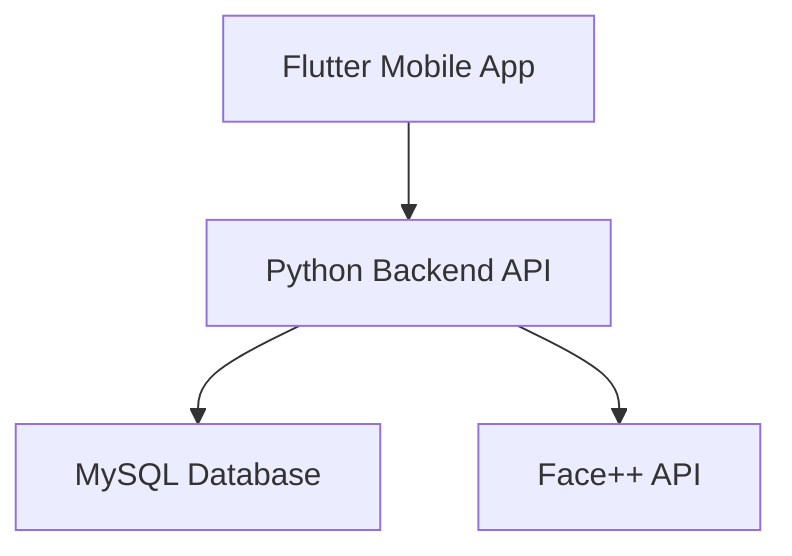

<h1 align="center">📸 cheese! - a Smart Attendance System using Face Recognition</h1>

<p align="center">
  
  
  
  
  
  
  
</p>

<p align="center">
A mobile-based smart attendance system that automates classroom attendance using facial recognition technology.
</p>

---

## 📌 Project Information

- **Course**: MAL2020 Computing Group Project  
- **Platform**: Mobile Application (Flutter)  
- **Project Type**: AI-based Attendance System  

---

## 👥 Team Members

| Name | ID |
|------|----|
| Chai Yee Pei | BSSE2506028 |
| Joey Low Yan Hui | BSCS2506056 |
| Tan Jun Yee | BSCS2506067 |
| Terence Lim Chia Mao | BSCS2506052 |

---

## 📱 Project Overview

**Cheese! Smart Attendance System** is a mobile application designed to automate student attendance using **facial recognition technology**.

Instead of manual roll calls or QR codes, lecturers can simply:
📸 Capture a classroom image → 🤖 System detects faces → ✅ Attendance recorded automatically

The system integrates **AI-powered face recognition (Face++)** with a mobile interface to provide a faster, more reliable, and fraud-resistant attendance solution.

---

## 📂 Project Structure

```bash
Smart-Attendance-System
├── android/
├── ios/
├── web/
├── windows/
├── linux/
├── macos/
│
├── lib/                 # Flutter frontend (UI & logic)
│   ├── providers/
│   └── services/
│
├── assets/
│   └── images/
│
├── backend/             # Python backend (REST API)
│   ├── static/
│   └── __pycache__/
│
├── migration/           # Database (MySQL schema & migrations)
├── uploads/             # Uploaded files/images
├── docs/                # Project documentation
│   ├── Sep 2025 - Interim/
│   └── Jan 2026 - Final/
│
├── test/
├── .github/
├── .vscode/
└── README.md
```

## ⚠️ Problems with Traditional Systems

- ❌ Time-consuming manual roll calls  
- ❌ Human errors in recording attendance  
- ❌ Proxy attendance (students signing for others)  
- ❌ QR codes can be shared easily  
- ❌ RFID cards can be lost or swapped  

---

## 🎯 Objectives

- ✅ Automate attendance using face recognition  
- ✅ Reduce proxy attendance and improve accuracy  
- ✅ Improve efficiency for lecturers  
- ✅ Provide real-time attendance tracking  
- ✅ Support digital transformation in education  

---

## 🚀 Key Features

- 📸 **Face Recognition Attendance** (Face++ API)
- 👤 **Student Enrollment with Facial Data**
- 📊 **Dashboard & Attendance Reports**
- 🔐 **Secure Login (Google & Microsoft OAuth)**
- 🧑‍💼 **Role-Based Access (Lecturer & Super Admin)**
- 📁 **PDF Report Generation**
- ⚙️ **User Settings & Profile Management**
- 📈 **Statistics & Analytics**

---

## 🔄 System Workflow

1. User logs into the system  
2. Lecturer creates subject and class  
3. Students are enrolled with facial data  
4. Lecturer captures classroom image  
5. System detects & recognises faces  
6. Attendance is recorded automatically  
7. Reports are generated  

---

## 🏗 System Architecture

The Smart Attendance System follows a modular architecture consisting of three main layers: frontend, backend, and external services.

### 🔹 Architecture Overview



### 🔹 Component Breakdown

- 📱 **Frontend (Flutter Mobile App)**
  - User interface for lecturers and admins
  - Captures images for attendance
  - Displays reports and dashboards

- ⚙️ **Backend (Python)**
  - Handles business logic and API requests
  - Processes attendance workflows
  - Communicates with Face++ API

- 🗄 **Database (MySQL)**
  - Stores users, students, attendance, and facial data
  - Maintains relationships between classes and students

- 🤖 **Face Recognition (Face++ API)**
  - Detects and recognises faces from images
  - Matches students with stored facial data

- 🔐 **Authentication Services**
  - Google OAuth 2.0
  - Microsoft Azure OAuth

### 🔹 Data Flow

1. Lecturer captures classroom image via mobile app  
2. Image is sent to backend API  
3. Backend sends image to Face++ API  
4. Face++ returns recognised student identities  
5. Backend updates attendance in database  
6. Results are displayed in the mobile app  

---

## 📊 System Roles

### 👨‍🏫 Lecturer (User)
- Manage classes and subjects  
- Enroll students  
- Take attendance using face recognition  
- View reports and statistics  

### 🛠 Super Admin
- Manage system users  
- Monitor logs and system activity  
- Configure system settings  

---

## 🔒 Security & Privacy

- 🔐 Encrypted data storage  
- 🔑 OAuth-based authentication  
- 👁 Role-based access control  
- 📜 Compliance with PDPA 2010  
- 🧑‍💻 Secure handling of biometric (facial) data  

---

## ⚡ Limitations

- Face recognition may fail if faces are obstructed (e.g. masks, sunglasses)  
- Large classes may require multiple images  
- Dependent on camera quality and lighting  

---

## 🔮 Future Improvements

- 🎥 Transition to **video-based recognition system**  
- 🧠 Improved recognition accuracy with AI enhancements  
- 🏫 Integration with university systems (LMS)  
- 🔐 Multi-factor authentication  
- 📡 Real-time surveillance-style attendance tracking  

---

## 📦 Deliverables

- ✅ Mobile Application  
- ✅ Final Report  
- ✅ Client Handbook  
- ✅ System Diagrams (ERD, Use Case, etc.)  

---

## 💡 Conclusion

The **Cheese! Smart Attendance System** provides a modern, efficient, and secure approach to attendance management. By leveraging facial recognition technology, the system reduces manual workload, minimises fraud, and enhances data accuracy, supporting the shift towards digital transformation in educational institutions.

---

## 📄 License

This project was developed for **academic purposes** under the **MAL2020 Computing Group Project**.
